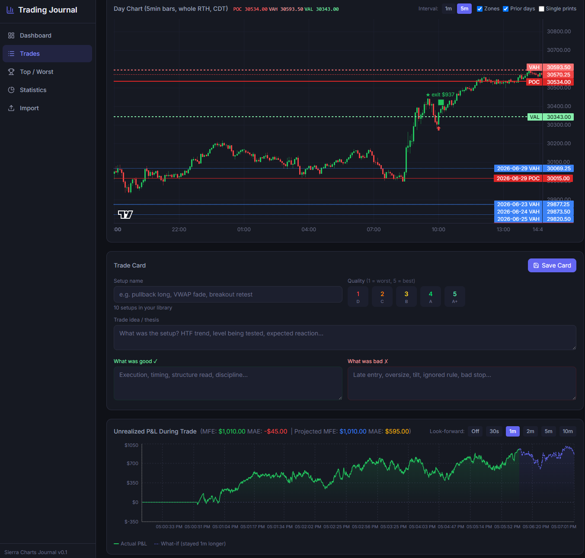

# Trading Journal

A local trade journal for Sierra Chart and Quantower futures traders.
Reads your trade-activity logs, plots each trade against a real intraday tape,
computes setup grades, MAE/MFE, business zones, and gives you a per-trade
review card so you can build a playbook from your own trades.

Runs entirely on your machine — no cloud, no data uploaded anywhere.



*Trade detail view: 5-min day chart with Business Zones (today + prior days),
the structured trade card, and the per-trade unrealized P&L curve with a
look-forward overlay.*

## What it does

- **Auto-import** trades from Sierra Chart `TradeActivityLog*.data` files and
  Quantower `user-trades.db`. Recognises live + Sim accounts separately.
- **Tick-data charts** for every trade, pulled live from your Sierra Chart
  `.scid` files (or an optional Parquet cache — see "Optional speedups" below).
- **Business Zones overlay** — Python port of the Sierra Chart BusinessZones
  v3.7 study (POC, VAH, VAL, single-print zones) computed from the RTH volume
  profile and shown on every day chart.
- **Trade Card per trade** — setup name, quality rating (1=worst, 5=best /
  A+/A/B/C/D), trade-idea text, what-was-good / what-was-bad fields. Saved
  per trade, persists across restarts.
- **Setup library** — autocomplete pulls from your own tagged setups with
  per-setup avg P&L, WR, count.
- **Day Summary card** with intraday equity curve, peak/trough, max-loss-streak,
  give-back tracker.
- **Top / Worst trades page** — side-by-side mini chart + P&L for the N best
  or worst trades on an account.
- **Statistics** — by-hour, by-day-of-week, by-duration, by-ATR, cumulative
  P&L, intraday curves, MFE/MAE distribution.
- **Sim vs Live filter** everywhere — every dropdown distinguishes
  `Account · Sim` from live trades.

## Requirements

| Tool | Version | Why |
|---|---|---|
| Windows | 10 / 11 | Sierra Chart only runs on Windows |
| Python | 3.11+ | Backend (FastAPI + numpy + pyarrow) |
| Node | 20+ | Frontend (Vite + React 19) |
| Sierra Chart | any recent | Source of tick data and Live trade logs |
| Quantower | optional | Reads `user-trades.db` if you have it |

## First-time setup (5 minutes)

```bat
:: 1.  Clone or copy the folder to wherever you want it
::     (say C:\Projects\TradingJournal — no special location required)

:: 2.  Run the installer
setup.bat
```

The installer checks for Python/Node, installs all dependencies, and copies
`backend\.env.example` → `backend\.env` plus
`backend\commissions.example.json` → `backend\commissions.json`.

### Then edit two files

**`backend\.env`** — point at YOUR Sierra Chart install path(s):

```env
SIERRA_CHART_PATHS=C:/SierraChart
# Add more if you run multiple SC instances:
# SIERRA_CHART_PATHS=C:/SierraChart,C:/SierraChartApex,D:/MySC

# Optional, leave blank if you don't use Quantower
QUANTOWER_ROOTS=C:/Quantower

# Optional Parquet tick cache — see "Optional speedups" below
TICKER_LIBRARY=

BACKEND_PORT=8001
FRONTEND_ORIGINS=http://localhost:5173,http://127.0.0.1:5173
```

**`backend\commissions.json`** — your broker fees per side, per contract:

```json
{
  "default": {
    "ES":  1.99,  "MES": 0.51,
    "NQ":  1.99,  "MNQ": 0.51
  },
  "per_account": {
    "YourPropAccountID": {
      "ES": 1.50,
      "NQ": 1.50
    },
    "Sim1": { "ES": 0.0, "MES": 0.0, "NQ": 0.0, "MNQ": 0.0 }
  }
}
```

The per-account rates win when set, otherwise the default rate is used.
**Sim accounts get 0** — you're not paying real commissions there.

### Launch

```bat
start.bat
```

Opens two terminal windows (backend + frontend) and your browser at
`http://localhost:5173`.

To stop: close the two terminals.

## How it knows what's a Sim trade

Sierra Chart writes Sim trades to `TradeActivityLog_<DATE>_UTC.<SimAccount>.simulated.data`
(note the `.simulated` suffix). The importer detects this and flags every
trade from those files as `is_sim=1`. All dropdowns and stats endpoints filter
by `(account, is_sim)` together, so a Sierra "Sim1" account is shown as
**Sim1 · Sim** in the UI and never mixed with real-money trades.

## Importing trades

Three ways, all routed through the same parser:

1. **Sierra Chart auto-scan** — the backend scans
   `<SIERRA_CHART_PATHS>/TradeActivityLogs/` on launch. Use the **Import**
   page in the UI to browse what's available and ingest.
2. **Quantower auto-scan** — the backend reads `user-trades.db` from each
   `<QUANTOWER_ROOTS>/UserTradesCache/<connection>/`. Click "Import Quantower"
   on the Import page.
3. **Single file** — drop a `TradeActivityLog_*.data` anywhere accessible
   and hit `POST /api/import/file?path=...`.

Imports are **idempotent**: re-running won't duplicate trades. The
`import_log` table tracks every file ever processed.

## Where the data lives

| | What | Where |
|---|---|---|
| **Tick data (read-only)** | Sierra writes these as it charts | `<SCpath>/Data/*.scid` |
| **Optional faster cache** | If you converted .scid to parquet | `<TICKER_LIBRARY>/<ROOT>_PARQUET/...` |
| **Trade logs (read-only)** | Sierra writes these per session | `<SCpath>/TradeActivityLogs/` |
| **Journal's own data** | Trades, fills, zones, settings | `backend/journal.db` (SQLite) |

The journal **does not duplicate or move your tick data**. It reads
on-demand from the Sierra Chart files. If you move/delete a `.scid` file,
the chart for that day stops working — the trade metadata stays.

## Optional speedups

If you trade frequently and tick-data charts feel slow, you can pre-convert
Sierra Chart `.scid` files to Apache Parquet (faster columnar reads). Point
`TICKER_LIBRARY` in `.env` at the root folder. Expected layout:

```
<TICKER_LIBRARY>/
   ES_PARQUET/
      ESM26_202606/
         20260616.parquet
         20260617.parquet
         ...
      ESU26_202609/
         ...
   NQ_PARQUET/
      ...
```

Parquet is purely optional — `.scid` files work fine, the LRU cache hides
most of the difference.

## What the UI looks like (top to bottom)

- **Dashboard** — quick P&L stats, equity curve, account dropdown
- **Trades** — paginated table, filter by date / account / side
- **Top / Worst** — N best or worst trades on an account with mini charts
- **Statistics** — multi-axis breakdowns
- **Import** — file scanner / one-click ingest
- **Trade Detail** (click any trade row) — close-up 15s chart, ±3h context
  chart, full-day chart with business zones, day summary card, structured
  trade card with autocomplete-from-history setup library

## Project layout

```
TradingJournal/
├── backend/                  Python / FastAPI
│   ├── main.py               API routes
│   ├── config.py             reads .env + commissions.json
│   ├── .env.example          template
│   ├── commissions.example.json   template
│   ├── sc_parser.py          Sierra Chart .data parser
│   ├── quantower_parser.py   Quantower SQLite reader
│   ├── tick_data.py          SCID + Parquet reader
│   ├── business_zones.py     VAH/VAL/POC computation
│   ├── database.py           SQLite schema + migrations
│   ├── tilt_detector.py      stand-alone CLI: tilt patterns
│   ├── aplus_detector.py     stand-alone CLI: A+/A/B/C grading
│   ├── ...                   other analytics scripts
│   └── requirements.txt
├── frontend/                 React 19 / Vite / Tailwind 4
│   └── src/pages/            Dashboard / Trades / TopTrades / Statistics / TradeDetail / Import
├── setup.bat                 first-time install
├── start.bat                 launch backend + frontend
└── README.md                 this file
```

## Configuration reference

### `backend/.env` keys

| Key | Required | Default | What |
|---|---|---|---|
| `SIERRA_CHART_PATHS` | yes | `C:/SierraChart` | Comma-list of SC install dirs |
| `QUANTOWER_ROOTS` | no | empty | Comma-list of Quantower install dirs |
| `TICKER_LIBRARY` | no | empty | Parquet tick-data root, optional |
| `DB_PATH` | no | `backend/journal.db` | Override the SQLite location |
| `BACKEND_HOST` | no | `0.0.0.0` | uvicorn bind host |
| `BACKEND_PORT` | no | `8001` | uvicorn port |
| `FRONTEND_ORIGINS` | no | `http://localhost:5173,http://127.0.0.1:5173` | CORS allowlist |

### `backend/commissions.json` schema

```jsonc
{
  "default": {
    "<ROOT>": <dollars-per-side>,   // e.g. "ES": 1.99
    ...
  },
  "per_account": {
    "<account-id>": {
      "<ROOT>": <dollars-per-side>, // overrides default for this account/symbol
      ...
    },
    ...
  }
}
```

Lookup: per-account-and-symbol → default-by-symbol → fallback `$0.50/side`.

Edit and restart the backend, or call `POST /api/admin/reload-commissions`
(if exposed). Existing P&L numbers in the DB are NOT recalculated — only
new imports use the new rates. To re-apply to history, re-import the file
with `force=true` or run a one-off script.

## Stand-alone analytics scripts

In `backend/` there are several CLI scripts for offline analysis. All
operate against `journal.db` and print to stdout:

```bat
:: Tilt / give-back / streak detector for a given account
python tilt_detector.py --account YourAcct --symbols ES

:: A+ / A / B / C setup grading
python aplus_detector.py --account YourAcct --symbols ES

:: Trade-time-of-day vs P&L analysis
python trade_analysis.py --account YourAcct --days 21

:: Counterfactual: "what if I'd only taken trades passing rule X?"
python causal_full.py --account YourAcct
```

Each prints a quick summary; some also write CSV/PNG outputs into
`backend/` (gitignored).

## When something goes wrong — the diagnostic checklist

Three places to look, in order of usefulness:

### 1. Hit `http://localhost:8001/api/diagnostics` in your browser

Returns the whole runtime state in one shot:

```json
{
  "config": {
    "sierra_chart_paths": [ {"path": "C:/SierraChart", "exists": true } ],
    "db_path": "...", "db_exists": true,
    "ticker_library": "", "ticker_library_exists": false,
    "frontend_origins": ["http://localhost:5173"]
  },
  "db": {
    "trades_total": 742, "trades_open": 0, "fills_total": 1845,
    "accounts": ["7502", "Sim1", ...],
    "latest_trade_date": "2026-06-30"
  },
  "sierra_discovery":    { "files_found": 88, "first_5": [...] },
  "quantower_discovery": { "dbs_found":  2,  "first_3": [...] },
  "logs": { "today_tail": [ "...recent log lines..." ] }
}
```

Most "why isn't this working?" questions answer themselves here:
- `sierra_chart_paths[].exists: false` → you misconfigured `.env`
- `trades_total: 0` → you haven't run an Import yet
- `db_exists: false` → DB will be created on first import
- `today_tail` has tracebacks → there's the real error

### 2. Backend log file

`backend/logs/journal-YYYY-MM-DD.log` — one file per UTC day, kept
indefinitely. Same format as the backend console window but persistent.
Paste the relevant ~50 lines around the error into a bug report or
GitHub issue.

### 3. Backend console window

The "TJ-Backend" terminal window that `start.bat` spawns. Live `INFO`
and `WARNING` lines stream there as the backend runs. Don't close it —
that kills the backend.

### Bumping log verbosity

Set `LOG_LEVEL=DEBUG` in `backend/.env` and restart. DEBUG logs include
every SQL query and every tick-file probe — useful when "no tick data"
or "0 trades imported" is the puzzle.

Filter the diagnostic log tail by severity:
`http://localhost:8001/api/diagnostics?log_level=ERROR&log_lines=200`

## Troubleshooting

- **"Loading trade..." spinner never finishes** → backend probably isn't
  running. Check the TJ-Backend terminal window. Also visit
  `http://localhost:8001/docs` directly — should show the API docs.

- **"No tick data available for this date"** → the tick file for the contract
  you traded isn't present in `<SCpath>/Data/`. Sierra writes tick files
  only while you have the contract charted. For historical days you didn't
  chart, you'll need to download history first inside Sierra Chart, then
  the journal can read them.

- **Wrong prices on a chart during contract roll** → fixed. The journal
  now extracts the exact contract code from each trade's symbol
  (`ESU26.XCME` → `ESU26`) and only reads ticks for that specific contract,
  so ESM26 ticks won't ever be plotted as ESU26 entries again.

- **Sim trades not showing up** → make sure the trade logs end with
  `.simulated.data`. If they're appearing under a real-account name, the
  Sierra Chart simulator wasn't tagging them. Re-import with `force=true`.

- **Commission totals don't match my broker statement** → edit
  `backend/commissions.json` and re-import the relevant files. The journal's
  default rates are Apex-style; many brokers differ.

## License

This is a personal tool shared between traders. No license — use it,
fork it, share it with one other person who'll find it useful. If you
break something useful, please file an issue.
